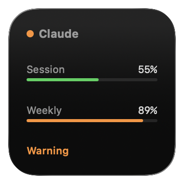
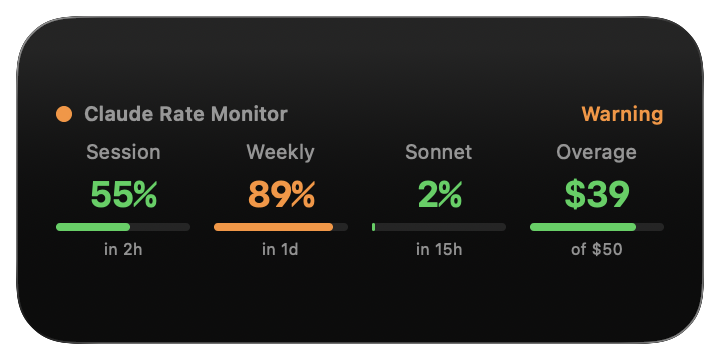

# Claude Rate Widget

**[Homepage](https://rate.huconn.xyz/)** | **[Download](https://github.com/hulryung/cc-rate-widget/releases/latest)**

A free, open-source native macOS widget that monitors your Claude Code rate limits at a glance. Never hit a rate limit unexpectedly again.

## Screenshots

| Small (1x1) | Medium (2x1) | Large (2x2) |
|:---:|:---:|:---:|
|  |  |  |

## Features

- **See all your limits at once** — Session (5h), Weekly, Weekly Sonnet, and Overage in a single widget
- **Color-coded status** — Green (active), orange (warning 80%+), red (rate limited) so you can spot problems before they hit
- **Reset countdowns** — Know exactly when each limit resets
- **Auto-refresh** — Updates every 15 minutes via WidgetKit
- **Three widget sizes** — Small, Medium, and Large to fit your workflow
- **Secure OAuth login** — Authenticate with your Anthropic account, no API keys needed

## Install

1. **Download** the latest DMG from [Releases](https://github.com/hulryung/cc-rate-widget/releases/latest)
2. **Drag** Claude Rate Widget to your Applications folder
3. **Launch** the app and log in with your Anthropic account
4. **Add widget** — Right-click your desktop > Edit Widgets > search "Claude Rate Monitor"

### Requirements

- macOS 14.0 (Sonoma) or later
- Active Claude Code / Claude Max subscription

---

## Development

### Prerequisites

- Xcode 16+
- [XcodeGen](https://github.com/yonaskolb/XcodeGen) (`brew install xcodegen`)

### Build from source

```bash
xcodegen generate
xcodebuild build -project CCRateWidget.xcodeproj -scheme CCRateWidget -configuration Release
```

The built app will be at:
```
~/Library/Developer/Xcode/DerivedData/CCRateWidget-*/Build/Products/Release/Claude Rate Widget.app
```

### Project structure

```
CCRateWidget/          # Main app (login UI, rate display)
RateWidgetExtension/   # Widget extension
Shared/                # Shared code (models, API, storage)
docs/                  # Landing page (Jekyll, GitHub Pages)
project.yml            # XcodeGen project spec
```
