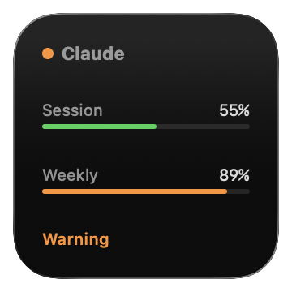
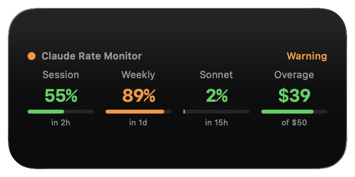
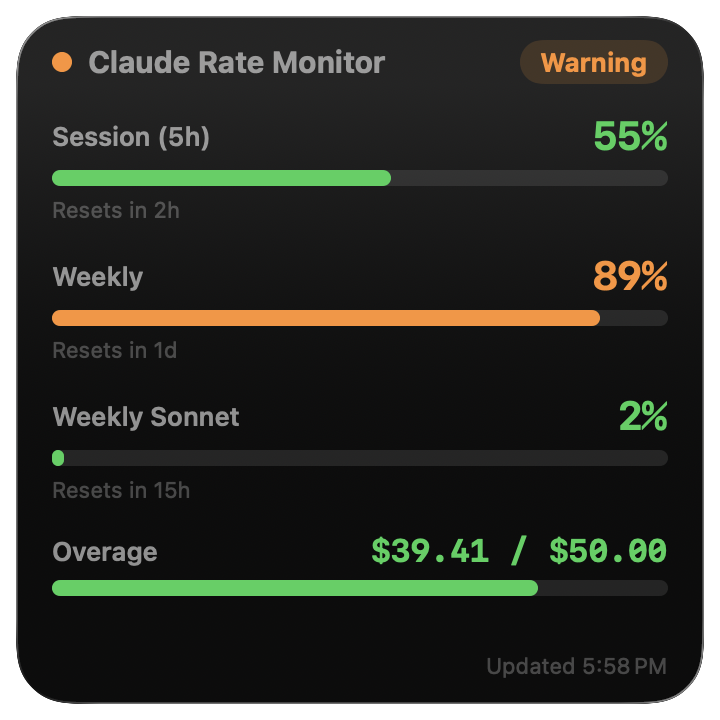

# Claude Rate Widget

**[Homepage](https://rate.huconn.xyz/)** | **[Download](https://github.com/hulryung/cc-rate-widget/releases/latest)**

A free, open-source native macOS widget that monitors your Claude Code rate limits at a glance. Never hit a rate limit unexpectedly again.

## Screenshots

| Small (1x1) | Medium (2x1) | Large (2x2) |
|:---:|:---:|:---:|
|  |  |  |

## Features

- **JSONL-primary data** — reads `~/.claude/projects/**/*.jsonl` locally; no network round-trip required
- **Per-project view** — see which projects burned which share of your current 5-hour and 7-day windows
- **Burn-rate alerts** — macOS notifications at 80% and 95% plus a "you'll hit the limit in X min" forecast
- **Three widget sizes** — Small, Medium, Large (Top-3 project strip on Large)
- **Opt-in menu bar mode** — keep the app alive in the background so alerts can fire
- **Optional OAuth** — pull Anthropic's official quota numbers when available (off by default)

## Install

### Homebrew (recommended)

```bash
brew install hulryung/tap/claude-rate-widget
```

### Manual

1. **Download** the latest DMG from [Releases](https://github.com/hulryung/cc-rate-widget/releases/latest)
2. **Drag** Claude Rate Widget to your Applications folder

### After install

1. **Launch** the app and log in with your Anthropic account
2. **Add widget** — Right-click your desktop > Edit Widgets > search "Claude Rate Monitor"

### Requirements

- macOS 14.0 (Sonoma) or later
- Active Claude Code / Claude Max subscription

## Changelog

### v1.7.0

- **Hybrid data source.** Local JSONL parsing is now the primary path; OAuth is optional and off by default.
- **Per-project attribution.** New Projects tab in the main app; Large widget shows Top 3 projects.
- **Burn-rate alerts.** 80% / 95% thresholds and ETA-to-100% forecasting via macOS notifications.
- **Opt-in menu bar mode.** Keep the app alive for background alerts.
- **App Sandbox dropped on main app** (widget extension remains sandboxed). Enables reading `~/.claude/`.

### v1.5.0

- Fix API compatibility: handle nullable `extra_usage.utilization` field in Anthropic usage API response
- Update OAuth endpoints from `console.anthropic.com` to `platform.claude.com` following Anthropic's domain migration (Jan 2026)
- Add `forbidden` status handling for Anthropic's third-party OAuth restrictions
- Improve error logging for easier debugging of token refresh and API failures

---

## Development

### Prerequisites

- Xcode 16+
- [XcodeGen](https://github.com/yonaskolb/XcodeGen) (`brew install xcodegen`)

### Build from source

```bash
xcodegen generate
xcodebuild build -project CCRateWidget.xcodeproj -scheme CCRateWidget -configuration Release
```

The built app will be at:
```
~/Library/Developer/Xcode/DerivedData/CCRateWidget-*/Build/Products/Release/Claude Rate Widget.app
```

### Project structure

```
CCRateWidget/          # Main app (login UI, rate display)
RateWidgetExtension/   # Widget extension
Shared/                # Shared code (models, API, storage)
docs/                  # Landing page (Jekyll, GitHub Pages)
project.yml            # XcodeGen project spec
```
